# MCM 최적화 및 의사결정 지원을 위한 Darts 기반 EDA 파이프라인

## 1. 분석 개요 및 비즈니스 목적

- 분석 목적: SKU 단위 판매 수요(`sales_qty`)의 간헐성, 변동성, 프로모션 민감도, 재고 커버리지를 통계적으로 분석하여 재고 전진 배치, 리밸런싱, 예측 모델 선택 기준을 수립한다.
- 분석 대상 및 기간: `2022-01-01`부터 `2026-07-04`까지의 MCM 판매 parquet 및 SKU, 재고, 프로모션 마스터.
- 목표 산출물: 데이터 정합성 검증, Darts `TimeSeries` 기반 주간 수요 구조 분석, ADI/CV2 수요 분류, 프로모션/재고/세그먼트 플롯, SKU별 처방 액션 테이블.

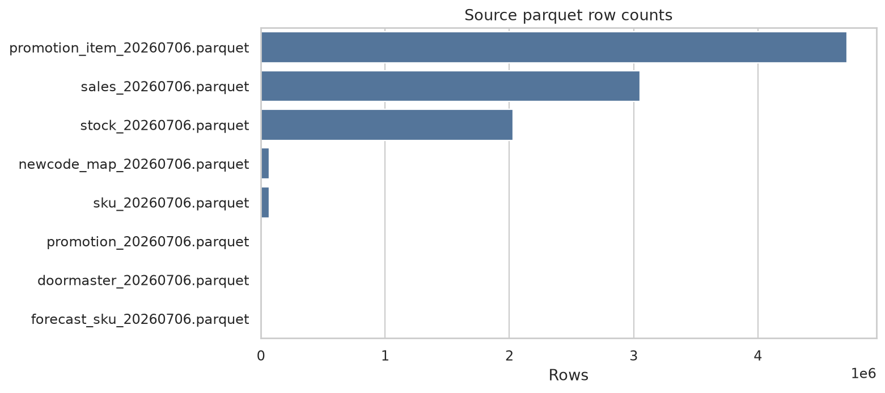

## 2. 데이터 정합성 검증 및 유효 구간 추출

- 원천 parquet: 8개 파일.
- 판매 행 수: 3,053,054건.
- 분석 SKU 수: 17,293개.
- 24주 이상 유효 수요 이력을 보유한 SKU: 16,693개.
- 유효 시작점은 SKU별 누적 판매량의 5% 도달일로 정의해 초반 노이즈 구간을 제거했다.

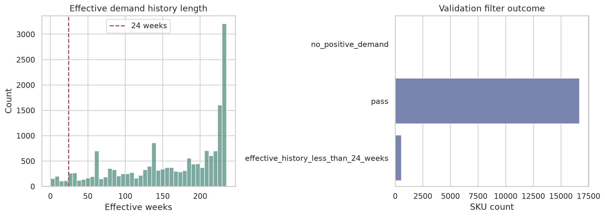

## 3. 통계적 데이터 프로파일링 및 패턴 분류

ADI 기준값 `1.32`, CV2 기준값 `0.49`를 적용해 Smooth, Erratic, Intermittent, Lumpy 수요군으로 분류했다.

| demand_class | sku_count | total_qty |
| --- | --- | --- |
| Lumpy | 3,512 | 1,242,048.000 |
| Erratic | 87 | 990,481.000 |
| Intermittent | 13,631 | 602,921.000 |
| Smooth | 39 | 37,229.000 |
| Insufficient | 24 | 0.000 |

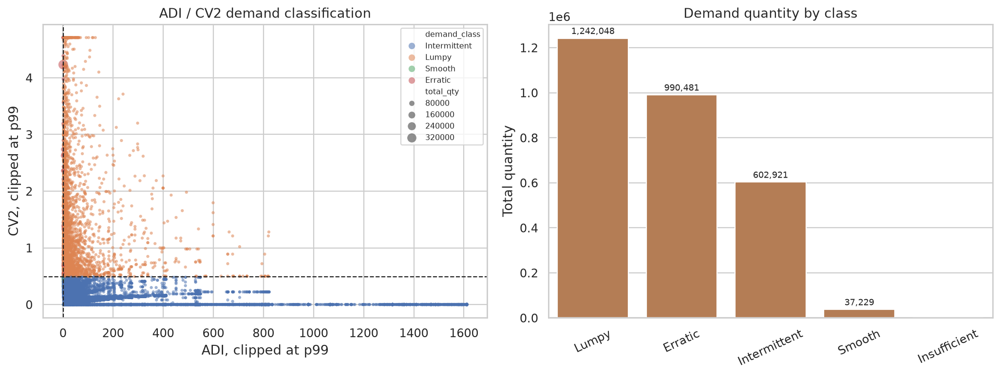

ABC/Pareto 관점에서는 상위 SKU가 전체 수요의 대부분을 견인하므로, 모델링과 재고 의사결정은 A등급 SKU를 우선 대상으로 삼는 것이 효율적이다.

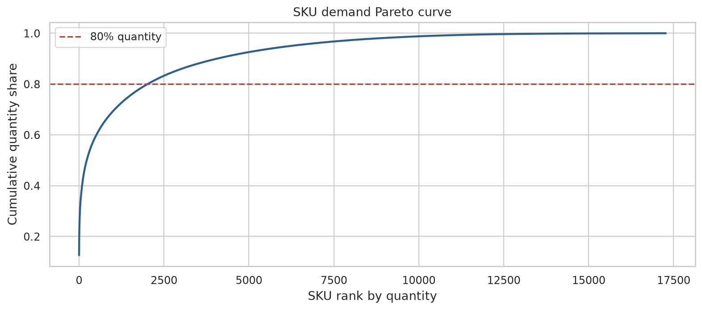

## 4. Darts TimeSeries 구조 분석 및 예측 기준선

전체 일별 수요를 주간 수요로 집계한 뒤 Darts `TimeSeries`로 변환했다. 이 객체를 기준으로 주간 수요 시각화, 상위 SKU baseline forecast, holdout backtest를 수행했다.

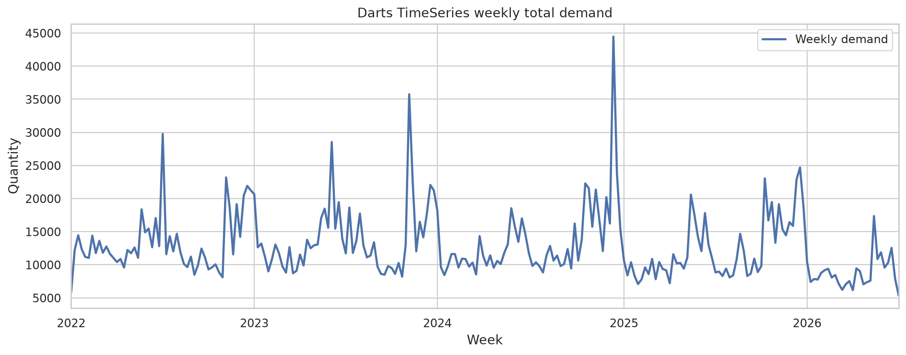

STL 분해 결과는 추세, 계절성, 잔차 이상 구간을 분리해 이벤트성 급등락을 추적할 수 있게 한다.

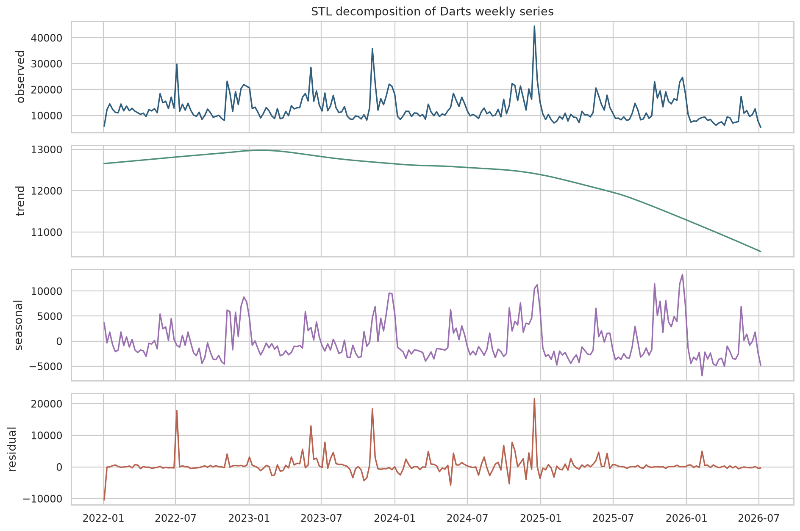

상위 SKU에 대해서는 Darts 시계열을 기반으로 최근 이동평균과 52주 계절 naive를 결합한 12주 baseline forecast를 산출했다.

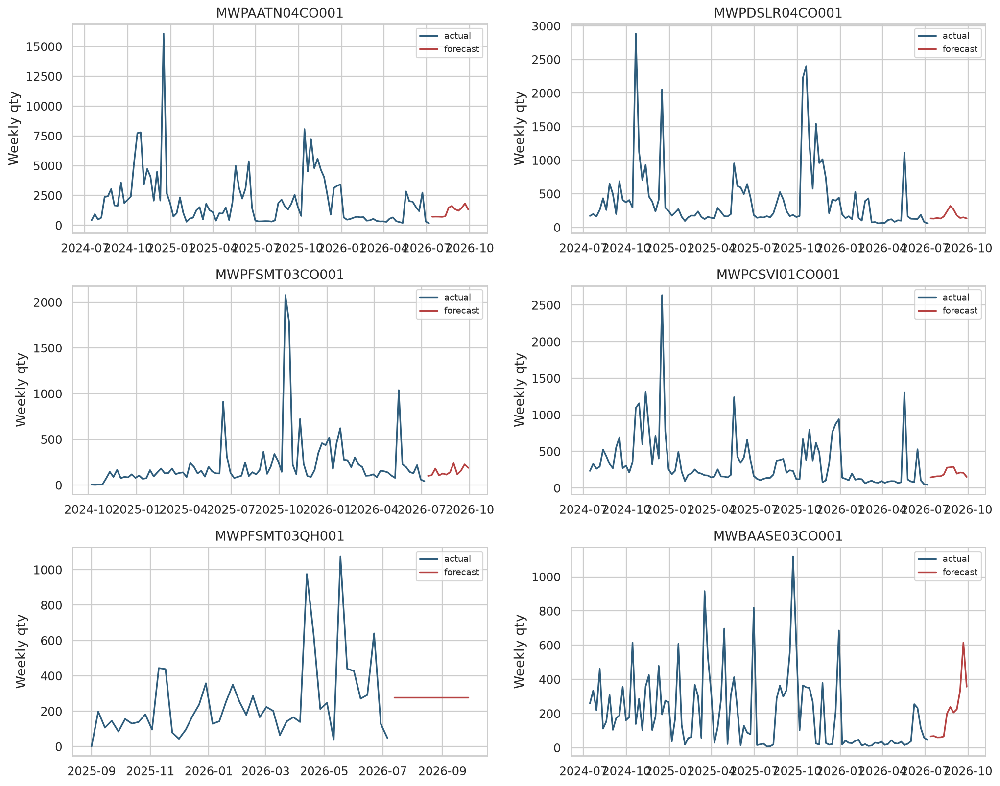

최근 52주 수요가 있는 상위 SKU holdout backtest의 중앙 WAPE는 MA4 `0.553`, seasonal naive `0.762`이다.

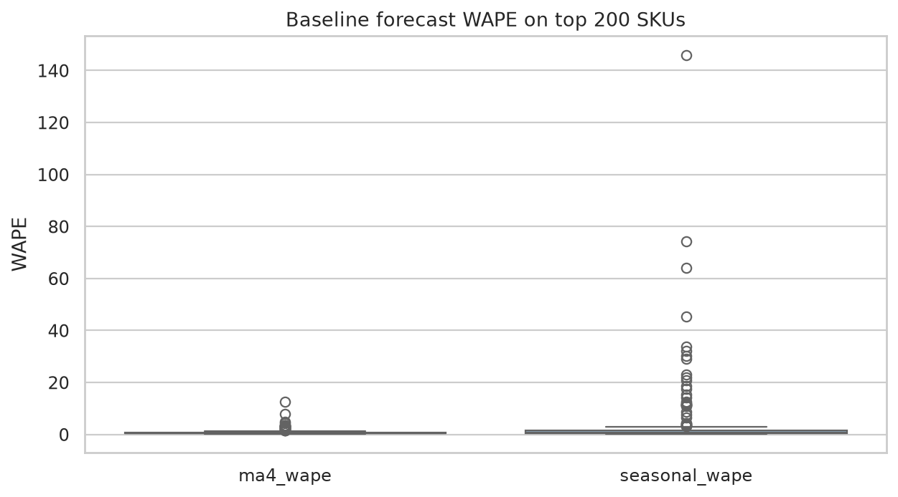

## 5. 다변량/구조적 동인 분석

프로모션 기간 내 평균 일 판매량과 비프로모션 평균 일 판매량을 비교해 SKU별 lift를 산출했다. Lift가 50% 이상인 상위 SKU는 58개로, 프로모션 사전 재고 배치의 우선 후보가 된다.

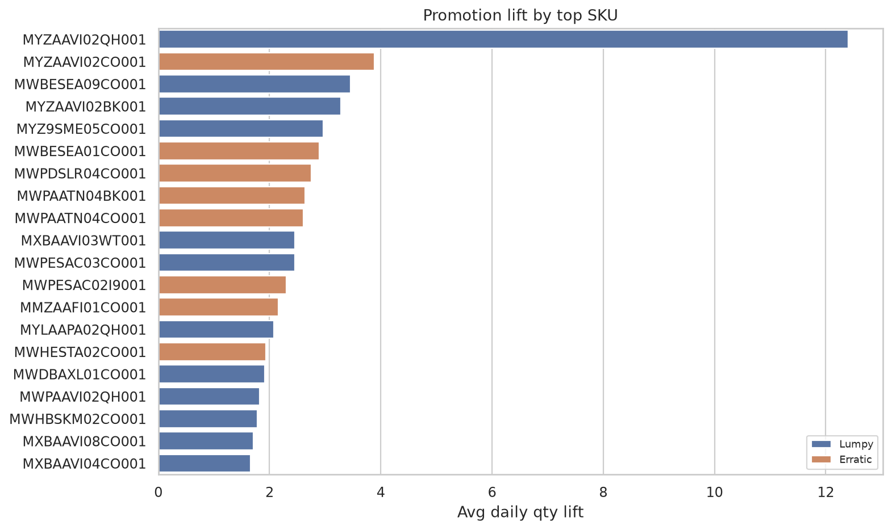

재고 리스크는 최신 재고, 최근 12주 판매 속도, stockout snapshot 비율을 결합해 high/medium/low로 구분했다. High risk SKU는 335개다.

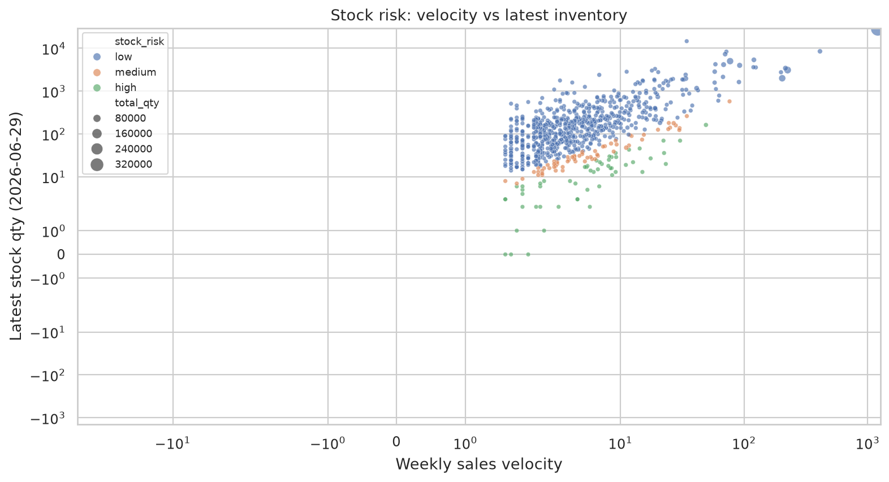

## 6. 다차원 세그먼트 교차 분석

지역과 상품 line의 교차 수요를 heatmap으로 비교했다. 특정 line이 특정 region에 집중되는 구조는 리밸런싱, 지역별 캠페인, 사이즈/컬러 배분 정책의 근거가 된다.

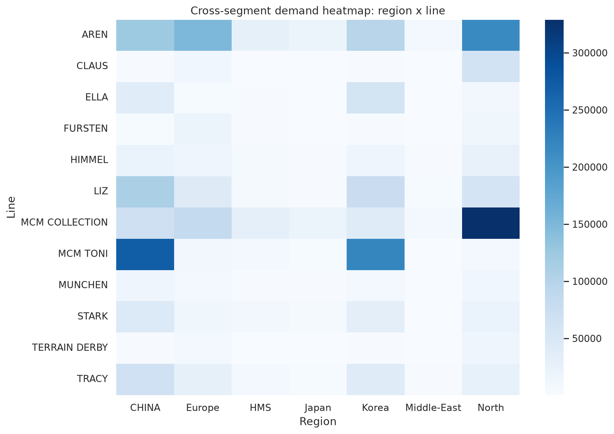

## 7. 최종 비즈니스 처방 및 액션 플랜

SKU별로 수요군, ABC, 재고 리스크, 프로모션 lift를 결합해 실행 액션을 배정했다.

| recommended_action | sku_count | total_qty |
| --- | --- | --- |
| use_intermittent_or_hierarchical_forecast | 16,499 | 1,735,137.000 |
| pre-position_inventory_before_promotion_window | 40 | 769,901.000 |
| monitor_with_weekly_baseline | 77 | 299,828.000 |
| replenish_or_rebalance_before_next_sales_cycle | 83 | 49,357.000 |
| cold_start_attribute_pooling | 594 | 18,456.000 |

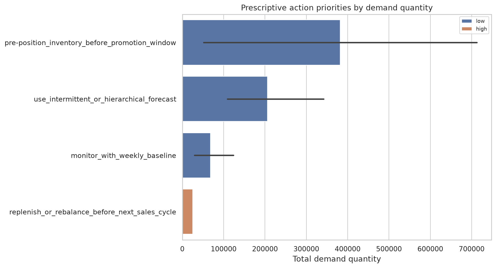

### 실행 권고

- A등급이면서 stock risk가 high인 SKU는 다음 판매 사이클 이전에 재고 보충 또는 지역 간 재배치를 우선 실행한다.
- 프로모션 lift가 high인 SKU는 프로모션 시작 전 최소 1~2개 주차 앞서 목표 채널에 재고를 전진 배치한다.
- Intermittent/Lumpy SKU는 일반 회귀 모델보다 intermittent method, weekly aggregation, hierarchical pooling을 우선 검토한다.
- 24주 미만 이력 SKU는 단독 시계열 모델보다 line/category/color/size 속성 기반 cold-start pooling으로 예측한다.

## 산출물

- `tables/03_valid_history_by_sku.csv`
- `tables/04_demand_profile_by_sku.csv`
- `tables/05_top_sku_darts_forecasts.csv`
- `tables/06_promotion_lift_top_skus.csv`
- `tables/06_stock_risk_by_sku.csv`
- `tables/08_prescriptive_actions_by_sku.csv`
